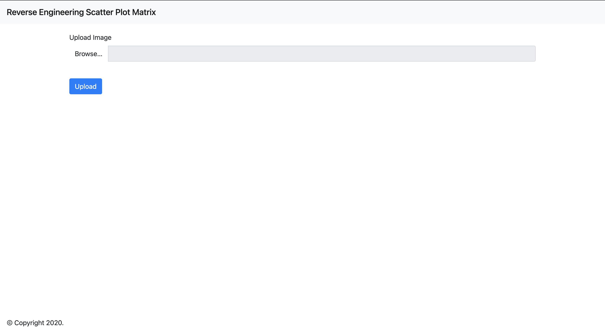
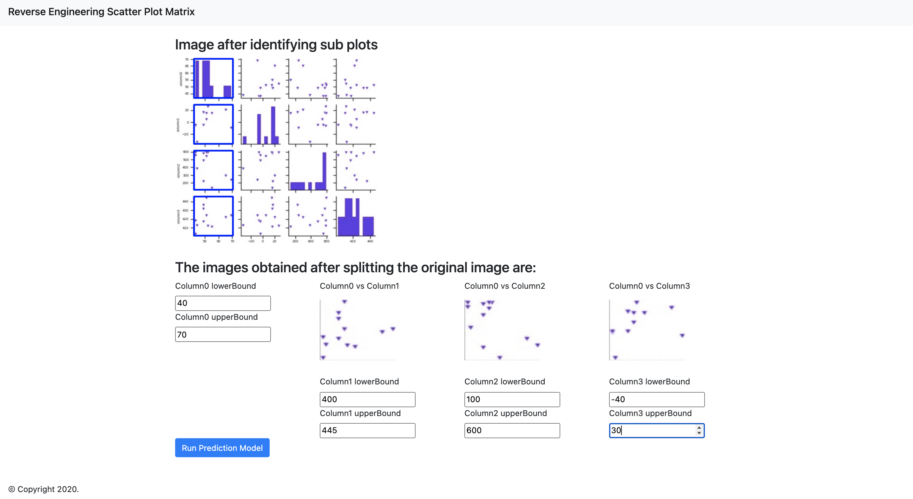
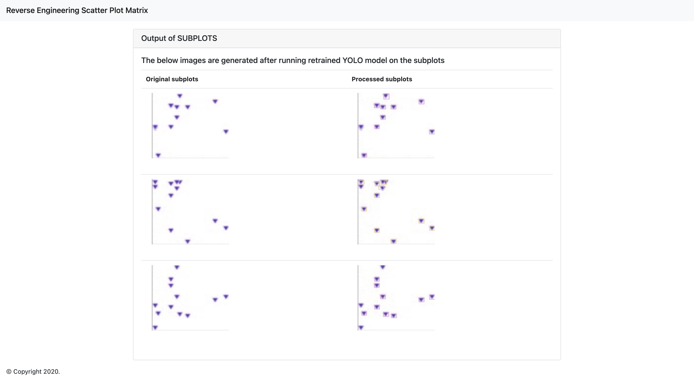
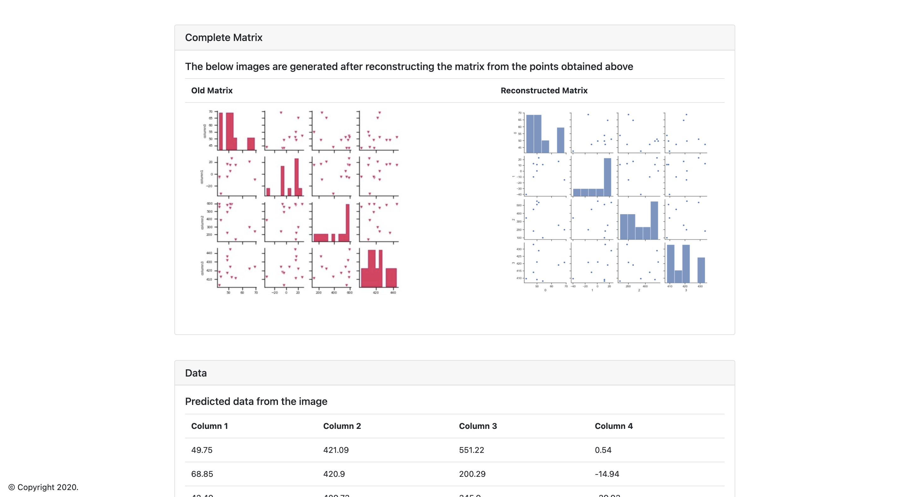
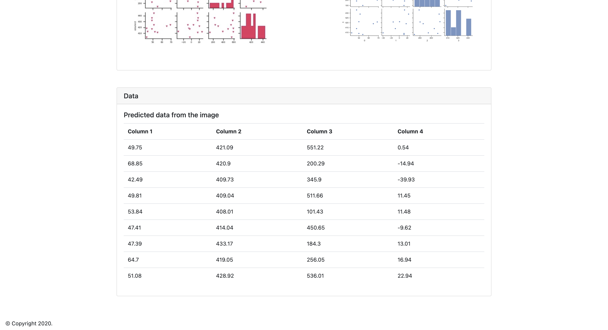

# ScatterPlot
Portal for scatterplot matrix reverse engineering

## Steps to run
```
pip install -r requirements.txt
Download model from https://drive.google.com/file/d/1dO64VeTLPk9ZsMZOjcEJ31D38vYrnxDF/view?usp=sharing and move it to trainedmodel/checkpoints
python app.py
```
Then go to http://localhost:5555/

## Sample Workflow
### Step 1
Upload the image in the portal at `http://localhost:5555/`


### Step 2
Fill in the limits for each of the columns and run the prediction model


### Step 3
You can see the following outputs
1. Identified boxes around the scatterplot points
	
2. Regenerated scatterplot matrix from the identified boxes
	
3. Corresponding data regenerated from the points identified in the first column of the scatterplot matrix *(Note: The reconstructed data is not accurate as SPM does not capture entire information)*
	